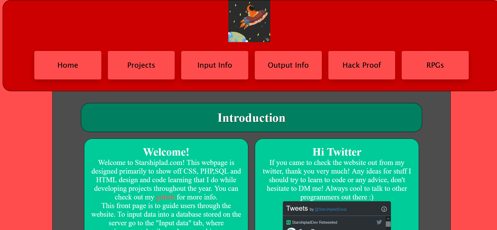
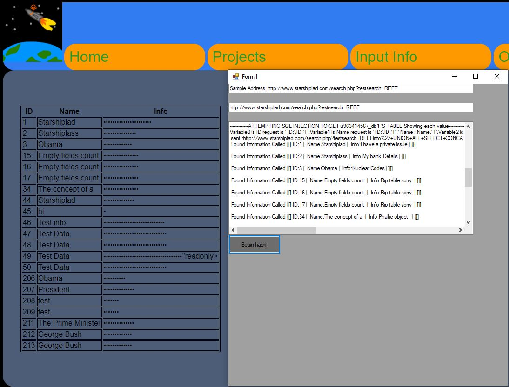
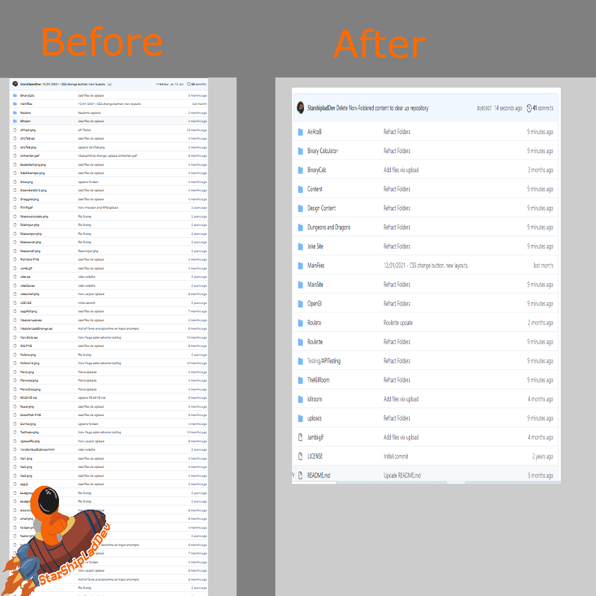

# www.Starshiplad.com -> (Personal Website Project )

## Notes/Know Bugs:

> Buttons in the header sections sometimes overshoot the header div on some screen sizes.

## Features(Planned In Brackets)

> React Application 

> Proper project webpage instead of a redirect to 

> Inbuilt Twitter API

> Google Maps API (starshiplad.com/airAToB.php)

> Portfolio Selection

> List of all written homebrew RPGs

## View of progress

### Q1 2018 - Old Design

### Q2 2020 - Latest design

### Q1 2021 - Refracted FileSystem 

## Latest Build
22/02/2021 - Refractored FileSystem

## Latest Update

22/02/2021 - Update KillRoom.com

> Use Git CMD for Mass Upload

> Add Canvas work to display new JS skills

## Next Build

End of July 2021 -React Wargame App

* Simple Text-Based React App

* New RPG PDF - ** Plots Politics and Power **

* Full Projects php page

* Updated Dungeons and Dragons Character Creator

## Skill developing

I planned on this project improving my skills in the following:

> HTML, PHP , SQL , Javascript, React , CSS

> Living and distinct portfolio hub

> Webdesign and aesthetic principles 

>Pixel Art and Animation

## Installing and Compiling:

The website can be found at https://www.starshiplad.com from any internet conected browser

